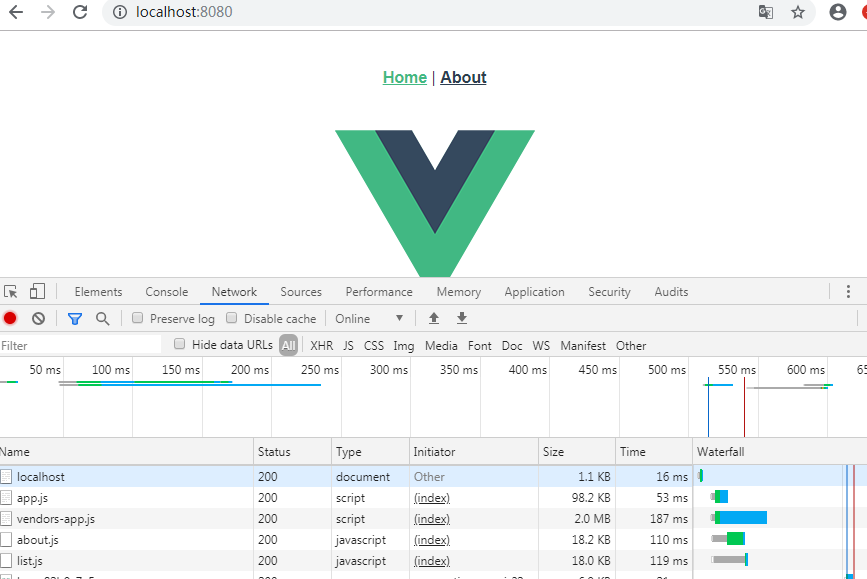

* content
{:toc}

## Webpack静态资源体积分析与总结
**前言**  
webpack目前已更新至 `4.41.2`。在 `webpack4` 版本下相对 `webpack3`，做了很多优化，有了更好的默认值、更为简洁的模式设置、对 `chunk` 的分割也更加智能，`splitChunks` 自定义如何分割代码块等等。对于整个项目来说，在包的构建速度、代码体积以及运行效率上都有一个质的飞跃。  
webpack4默认的配置对于大部分简单应用来说已经够用了，但作为打包工具本身来说，它不可能满足所有的业务场景和形态，我们还是可以从中做一些优化来适配。  
本文所述的优化均是基于 `webpack4` 而言。  

#### webpack内置分析工具 
##### 1. **stats** 
webpack构建完成后，用户可以生成一个包含模块统计信息 `stats` 的 JSON 文件。这个统计信息可以用来分析应用的依赖以便优化我们的构建。
生成方式如下：  
```
webpack --profile --json > stats.json
```
输出的 JSON 文件内容如下：  
```
{
  'version': '5.0.0-alpha.6', // Version of webpack used for the compilation
  'hash': '11593e3b3ac85436984a', // Compilation specific hash
  'time': 2469, // Compilation time in milliseconds
  'filteredModules': 0, // A count of excluded modules when exclude is passed to the toJson method
  'outputPath': ''/', // path to webpack output directory
  'assetsByChunkName': {
    // Chunk name to emitted asset(s) mapping
    'main': [
      'web.js?h=11593e3b3ac85436984a'
    ],
    'named-chunk': [
      'named-chunk.web.js'
    ],
    'other-chunk': [
      'other-chunk.js',
      'other-chunk.css'
    ]
  },
  'assets': [
    // A list of asset objects
  ],
  'chunks': [
    // A list of chunk objects
  ],
  'modules': [
    // A list of module objects
  ],
  'errors': [
    // A list of error strings
  ],
  'warnings': [
    // A list of warning strings
  ]
}
```
文件中包含了整个应用的构建信息，但是颗粒度不够细，对于分析意义不是很大。

##### 2. 可视化构建分析  
体积分析工具 `webpack-bundle-analyzer`， 它可以将打包后的资源文件以方便交互的树状图来呈现，通过这个图我们可以直观的分析应用的模块组成，进一步分析然后优化它。

**安装**    
```
# npm
npm install -D webpack-bundle-analyzer

#yarn
yarn add -D webpack-bundle-analyzer
```
**使用**
在 webpack.config.js 中配置  

```
const BundleAnalyzerPlugin = require('webpack-bundle-analyzer').BundleAnalyzerPlugin;
module.exports = {
	plugins: [
	    new BundleAnalyzerPlugin()
	]
}
```
build 完成后，webpack-bundle-analyzer 会自动启动一个静态服务器并打开网页显示资源的树状图。如：
  

##### 3. --report  
项目构建时加上 --report 可以自动打开浏览器，显示项目依赖界面。  
``` 
// package.json  
"build": "vue-cli-service build --report"  
```
### Webpack打包资源体积优化
#### 1. 打包拆分策略  
在做优化之前，我们必须对自己的项目工程结构有所了解，针对不同的业务场景，优化的侧重点也是不一样的。主要从以下几种类型几个维度来思考如何划分我们的包，并尽可能的利用浏览器缓存。  
类型 | 共用频率 | 使用频率 | 更新频率 | 例如
- | :-: | :-: | :-: | -:
基础类库 | 高 | 高 | 低 | vue/react、vuex/mobx、x-router、axios等| 
UI组件库 | 高| 高 | 中 | iView、elment-ui、ant design等|  
重要组件/函数 | 高| 高 | 中 | Menu/Header/Footer组件、路由钩子函数、权限拦截器、全局配置等|  
业务代码 | 低| 高 | 高 | 业务组件、模块、页面等| 
低频组件 | 低| 低 | 低 | moment、d3、富文本等|   
根据上表我们将代码划分为如下几类来进行拆分：  
* 基础类库  libs  
基础类库是项目中不可缺少的，如 `vue` + `vue-router` + `vuex` + `axios` 这种标准的全家桶，升级频率不高，但每个页面都依赖他们，我们可以将它们单独提取出来进行打包。

* UI 组件库  
UI 组件库理论上也可以放入 libs 中，但是考虑到它一般比较大，比如 `element-ui` 压缩完接近 200kb 左右，而且 UI 组件库的更新频率也相对 libs 更高，我们会不时升级 UI 组件来解决 bug 或使用新功能，所以建议将UI 组件库单独拆包。  

* 重要组件/函数  
重要组件/函数在项目中必须加载他们才能正确运行，比如全局路由、菜单栏/header/footer等组件以及自定义的 SVG 图标等等，它们是入口必须的，默认打包到 `app.js` 中。  
还有一些组件或函数没有在入口 `entry` 中引入，但是却被大部分页面使用，比如我们自己封装的 table 组件，由于体积不大，会被默认打包到每一个懒加载的页面 chunk 中去，假如有十个个页面引用了它，就会被重复打包十次，这样会造成不少的浪费。所以应该将那些复用频次高的公共组件单独打包。  

* 业务代码  
业务代码通常按照页面来打包，配合动态加载import()方法，将业务作为分离的模块起点，被请求的模块和它所引用的子模块，会分离到一个单独的chunk中。比如在 vue 中，使用 `懒加载` 的方式加载的页面  
```
component: () => import('./Foo.vue')
```
这样，webpack会将它打包成一个单独的 bundle 。  

* 低频组件  
低频组件和公共组件的区别在于，它们只会在特定的业务场景使用，比如富文本编辑器，这些库都是第三方并且体积大于 30kb， webpack4 会将它们默认打包成一个独立的 bundle。如果小于 30kb 会被打包到具体使用的页面 bundle 中。具体情况具体分析，通过 webpack 提供的 code spliting 完成。  

完整的 `splitCunks` 配置如下：  
```
splitChunks: {
  chunks: "all",
  cacheGroups: {
    libs: {
      name: "chunk-libs",
      test: /[\\/]node_modules[\\/]/,
      priority: 10,
      chunks: "initial" // 只打包初始时依赖的第三方
    },
    elementUI: {
      name: "chunk-elementUI", // 单独将 elementUI 拆包
      priority: 20, // 权重要大于 libs 和 app 不然会被打包进 libs 或者 app
      test: /[\\/]node_modules[\\/]element-ui[\\/]/
    },
    commons: {
      name: "chunk-comomns",
      test: resolve("src/components"), // 可自定义拓展你的规则
      minChunks: 2, // 最小共用次数
      priority: 5,
      reuseExistingChunk: true
    }
  }
};
```

我们可以看看webpack4 提供了哪些默认的 optimization 配置，以便进一步结合自身项目来进行更改适配。  
```
// optimization 默认配置 

optimization: {
    minimize: env === 'production' ? true : false, // 开发环境不压缩
    splitChunks: {
        chunks: "async", // 共有三个值可选：initial(初始模块)、async(按需加载模块)和all(全部模块)
        minSize: 30000, // 模块超过30k自动被抽离成公共模块
        minChunks: 1, // 模块被引用>=1次，便分割
        maxAsyncRequests: 5,  // 异步加载chunk的并发请求数量<=5
        maxInitialRequests: 3, // 一个入口并发加载的chunk数量<=3
        name: true, // 默认由模块名+hash命名，名称相同时多个模块将合并为1个，可以设置为function
        automaticNameDelimiter: '~', // 命名分隔符
        cacheGroups: { // 缓存组，将所有加载模块放在缓存里面一起分割打包
            default: { // 模块缓存规则，设置为false，默认缓存组将禁用
                minChunks: 2, // 模块被引用>=2次，拆分至vendors公共模块
                priority: -20, // 优先级
                reuseExistingChunk: true, // 默认使用已有的模块
            },
            vendors: {
                test: /[\\/]node_modules[\\/]/, // 表示默认拆分node_modules中的模块
                priority: -10
            }
        }
    }
}
```
#### 2. 按需引入
我们在项目开发中经常会引用到一些第三方库，比如lodash，echarts，这些库在我们的项目中默认是全量引入的，但实际我们只用到库里的某些组件或者某些函数，按需打包我们使用的组件或函数就可以减少相当大一部分的体积。  
以 `lodash` 为例，全包引入的话有 400kb 体积，使用模块化按需引入，可减少体积，具体做法是结合 `lodash-webpack-plugin` 和 `babel-pluigin-lodash`，它可将全路径引用的 `lodash` 自动转换为模块化引入，配置上也是十分简单。 ：  

```
// 引入组件，自动转换
import _ from 'lodash'
_.debounce()
_.throttle()

```
以上写法可能还是不够快捷，每个用到的文件都要写一遍 import，更可取的的方法是，将项目所需的方法，统一按需引入，组建一个本地的 lodash 库，然后导出 export 给我们的项目框架层，如 `Vue.prototype`，以便我们全局使用。  
```
import _ from 'lodash'
export default {
  cloneDeep: _.cloneDeep,
  debounce: _.debounce,
  throttle: _.throttle,
  size: _.size,
  pick: _.pick,
  isEmpty: _.isEmpty
}

// 注入到全局
import _ from '@helper/lodash.js'
Vue.prototype.$_ = _

// vue 组件内运用
this.$_.debounce()
```

#### 3. 压缩混淆  
对于中等规模以上开发，我们一般区分 `开发环境`、`生产环境`和`测试环境`。对待生产环境，合理的压缩混淆可以有效的减小打包体积，同时移除一些调试信息，如 `console`。  
webpack4 废弃了 `CommonsChunkPlugin`插件，使用 `optimization.splitChunks` 和 `optimization.runtimeChunk` 来替换。  
webpack4 内置了 `UglifyJs` 插件，当打包模式 `mode` 为 `production` 时，会自动开启压缩js代码。  
css压缩可以使用插件 `optimize-css-assets-webpack-plugin`。
```
const OptimizeCssAssetsPlugin = require('optimize-css-assets-webpack-plugin')
```

```
optimization: {
    splitChunks: {
      chunks: 'all'
    },
    runtimeChunk: true,
    minimizer: [
      new OptimizeCssAssetsPlugin({})
    ]
  },
```

```
new OptimizeCssAssetsPlugin({
      assetNameRegExp: /\.optimize\.css$/g,
      cssProcessor: require('cssnano'),
      cssProcessorOptions: { safe: true, discardComments: { removeAll: true } },
      canPrint: true
    }),
```
#### 4. 图片压缩  
webpack 打包时，会根据 webpack.config.js 中 `url-loader` 设置的 `limit` 大小对图片进行处理，小于 limit 的图片会转化成 base64 格式，其他的不做操作。对于较大的图片我们还可以用 `image-webpack-loader` 来压缩图片。  
```
// webpack.config.js 

{
  test: /\.(png|jpe?g|gif|svg)(\?.*)?$/,
  use:[
    {
    loader: 'url-loader',
    options: {
      limit: 10000,
      name: utils.assetsPath('img/[name].[hash:7].[ext]')
      }
    },
    {
      loader: 'image-webpack-loader',// 压缩图片
      options: {
        bypassOnDebug: true,
      }
    }
  ]
}
```
#### 5. 开启Gzip  
关于 HTTP 压缩，百度百科的解释如下：
>HTTP 压缩是一种内置到网页服务器和网页客户端中以改进传输速度和带宽利用率的方式。在使用 HTTP 压缩的情况下，HTTP 数据在从服务器发送前就已压缩：兼容的浏览器将在下载所需的格式前宣告支持何种方法给服务器；不支持压缩方法的浏览器将下载未经压缩的数据。最常见的压缩方案包括 Gzip 和 Deflate。  

可以说，Gzip是 HTTP 压缩的经典。  
**Gzip 的好处**  
开启Gzip可以减小文件体积，传输速度更快。服务端和客户端都可以做 Gzip。
* 服务端可以使用 nginx 或 node 做压缩。
* webpack可以通过插件做压缩。  
webpack实现 Gzip:
```
const CompressionWebpackPlugin = require('compression-webpack-plugin');
```

```
webpackConfig.plugins.push(
    new CompressionWebpackPlugin({
      asset: '[path].gz[query]',
      algorithm: 'gzip',
      test: new RegExp('\\.(js|css)$'),
      threshold: 10240,
      minRatio: 0.8
    })
)
```
开启Gzip前   
  
开启 gzip 后 

webpack中的 Gzip主要是为了在构建过程中去做一部分服务器的工作，为服务器分压。服务器的 Gzip和 webpack 的 Gzip谁也不能替代谁，需要我们结合业务压力与服务器 CPU 情况来权衡。

#### 6. Tree-Shaking  
删除冗余代码的典型应用就是 `Tree-Shaking `。  
`Tree-Shaking ` 的消除原理是基于 ES6 的模块特性， 可以在编译过程中确定模块的依赖关系悉，获知哪些模块没有被真正使用，在打包的时候会将这些没用的代码删除掉。  

举个例子：  
在某个页面中  
```
import { page1, page2 } from './pages'
    
// show是事先定义好的函数
show(page1)
```
pages 文件里导出了两个页面：  
```
export const page1 = xxx

export const page2 = xxx
```
但事实上，page2 并没有被用到，打包结果会把 ' export const page2 = xxx '这部分代码直接删掉。  
注意：要使用 `Tree-Shaking `，必须保证引用的模块都是 ES6 规范的,如果项目中使用了 Babel，这就比较麻烦了，因为 Babel的预置默认把模块转译成了 **CommonJS** 模块，我们可以设置 modules: false 来解决此问题。(注：babel7 不推荐使用 babel-preset-2015， 而是 babel-preset-env 来实现基于特定环境引入需要的polyfill)  
在 .babelrc 或者 webpack中设置。  

```
/// .babelrc
{
  "presets": [
    ["env",
      {
        "modules": false
      }
    ]
  ]
}
```

```
// webpack.config.js
 
module: {
  rules: 
    {
      test: /\.js$/,
        exclude: /(node_modules)/,
          use: {
            loader: 'babel-loader',
            options: {
              presets: ['env', { modules: false }]
            }
          }
    }
  ]
}
```
为了在webpack中使 Tree-Shaking 起作用，需要满足许多条件，需要使用 **ES6** 模块和 **UglifyJsPlugin**，同时需要配置 **optimization**，并将其 usedExports 和 sideEffects 设为 true。  
```
// webpack.config.js
const UglifyJsPlugin = require('uglifyjs-webpack-plugin');
 
module.exports = { 
  mode: 'none',
    optimization: {
      minimize: true,
      minimizer: [
        new UglifyJsPlugin()
      ],
      usedExports: true,
      sideEffects: true
    }
 
}
```

在当下，想要合理利用tree-shaking，能尽力做的事：  

* 使用 ES6 模块语法编写代码
* 尽量不写带有副作用的代码。诸如编写了立即执行函数，在函数里又使用了外部变量等
* 工具类函数尽量以单独的形式输出，不要集中成一个对象或者类
* 声明 sideEffects  

#### 7. 公共文件提取  
虽然我们对代码进行了拆分优化，但是在编译过程中，每次都需要对这些基础组件进行打包，对于不常更新的第三方库我们可以提前进行打包，在持续构建的过程中，就可以节省这部分时间了。    
`DllPlugin` 就是这样一个提前打包的插件，在 webpack 中通过 `DllReferencePlugin` 引入提前打包好的文件，最后使用 `AddAssetHtmlPlugin`  往里注入 vendor 文件。  
webpack.dll.conf.js 配置如下：  

```
// webpack.dll.conf.js
const webpack = require('webpack');
const path = require('path');
const dllDist = path.join(__dirname, 'dist');

module.exports = {
  entry: {
    vendor: ['vue', 'vuex', 'vue-router', 'axios', 'moment'],
  },

  output: {
    path: const dllDist = path.join(__dirname, 'dist'),
    filename: '[name]-[hash].js',
    library: '[name]',
  },
  optimization: {
    minimizer: [
    ],
  },
  plugins: [
    new CleanWebpackPlugin(["*.js"], { // 清除之前的dll文件
      root: dllDist,
    }),
    new webpack.DllPlugin({
      path: path.join(__dirname, 'dll', '[name]-manifest.json'),
      name: '[name]',
    }),
  ]
};
```
webpack配置
```
const manifest = require('./dll/vendor-manifest.json');
const AddAssetHtmlPlugin = require('add-asset-html-webpack-plugin');
...
plugins: [
    // webpack读取到vendor的manifest文件对于vendor的依赖不会进行编译打包
    new webpack.DllReferencePlugin({
      manifest,
    }),
    // 往html中注入vendor js
    new AddAssetHtmlPlugin([{ 
      publicPath: "/view/static/js",  // 注入到html中的路径
      outputPath: "../build/static/js", // 最终输出的目录
      filepath: path.resolve(__dirname, './dist/*.js'),
      includeSourcemap: false,
      typeOfAsset: "js"
    }]),
]
```
注意：当组件库更新时需要手动升级，并执行 dll 命令，更新我们的 vendor 文件。  

#### 其他建议  
**包引入的必要性**   
现在的前端大多是 `MVVM` 模式的框架，基于数据的双向绑定，像 `jQuery` 这样的库，完全没有引入的必要，用几行原生代码能解决的事，没有必要引入这样的庞然大物。  

**避免引而不用**  
在大型项目中，很难保证每个引入的库都被利用到，如果有引入却未使用的类库，只会徒增打包体积，影响性能。这时可以借助工具在开发时进行约束，推荐使用 `ESlint` 等这类工具，注入规则，对声明未使用的代码进行强制提醒，有效避免类似情况发生，还能统一团队开发规范，一举多得。  

**引入适合的包**  
类似 `momentjs`，它给我们带来便利的同时，也在一定程度上影响了性能，和它功能类似的类库还有很多，我们可以选择体积更加小的，满足开发需求即可。

### 代码分割 & **optimization.splitChunks**

#### 代码分割的本质


> 代码分割的本质就是在**源代码直接上线**和**打包成唯一的脚本main.bundle.js**这两种极端方案之间寻找一个更适合实际业务场景的中间状态，用可接受的服务器性能压力增加来换取更好的用户体验。  

**splitChunks基本配置**   

1、`chunks` 分割代码的模式  

* all: 不管文件是动态还是非动态引入，统一将文件进行分离。当页面首次载入时会引入所有的包。  
* async: 将异步加载文件进行分离，首次一般不引入，到需要异步引入的组件才会引入。  
* initial: 只分割同步引入的模块,及入口模块。

2、`minSize` 表示抽取出来的文件在压缩前的最小大小，单位为 byte，默认为30000。

3、 `maxSize` 表示抽取出来的文件在压缩前的最大大小，默认为 0，表示不限制最大大小。

4、 `minChunks` 模块最小引用次数  
如当值为2时，表示只引用了一次的模块不做分割打包处理。 

5、 `maxAsyncRequests` 按需(异步)加载模块最大并行请求数，默认为5 
如：打开某个页面需要同时加载10个库，且设置 maxAsyncRequests: 5，那么这10个库会被分割成5个模块。  

6、`maxInitialRequests` 入口文件可并行加载的最大文件数量，默认为3 
如：maxInitialRequests: 3，有pageA中，使用了大量 import xx from 'yy'，那么pageA依赖的这些非动态加载的模块，最多只会被打包成3个模块。  

7、`automaticNameDelimiter` 缓存组名称和生成文件名称之间的连接字符串  

* name 为 true 时，分割文件名为 [缓存组名][连接符][入口文件名].js  
* name 为 false 时，分割文件名为 [模块id][连接符][入口文件名].js  
* 如果缓存组存在 name 属性，则以缓存组的 name 属性为准

8、`cacheGroups` 缓存组，splitChunks最核心的配置，上面的属性都是对缓存组进行配置的，且缓存组会继承splitChunks的配置。  
当符合代码分割的条件时，就会进入缓存组，把各个模块进行分组，最后一块分割打包。  
splitChunks默认有两个缓存组: vendors 和 default：  
```
optimization: {
    splitChunks: {
      ...
      cacheGroups: {
        vendors: {
          test: /[\\/]node_modules[\\/]/,
          priority: -10
        },
        default: {
          minChunks: 2,
          priority: -20,
          reuseExistingChunk: true
        }
      }
    }
  }
```

### prefetch & preload  
**引入**  
异步加载模块解决了首页加载慢的问题，但同时可能因为异步加载的那部分代码迟迟不能执行，导致用户交互长时间没有响应，影响用户体验。  
这时候就需要 `prefetch` 和 `preload` 了。  
**Webpack 4.6.0** 为我们提供了**预先拉取（prefetch）** 和 **预先加载（preloading）** 功能，使用这些声明可以修改浏览器处理异步chunk的方式。  

**预先拉取**  
表示该模块可能以后会用到，浏览器会在空闲时间下载该模块，且下载是发生在父级chunk加载完成之后。  
```
import(
  `./module/a`
  /* webpackPrefetch: true */
  /* webpackChunkName: 'a'*/
)
```
这样的导入会在页面头部添加一段如下代码：  
```
<link rel="prefetch" as="script" href="a.js" >
```
因此浏览器会在空闲时间预先拉取该文件。  

**预先加载**  
对资源添加预先加载的注释，指明该模块需要立即被使用，异步chunk和父级chunk并行加载。如果父级chunk先下载好，页面即可显示，同时等待异步chunk的下载。这能大幅提升性能。  
```
import(
  `./module/a`
  /* webpackPreload: true */
  /* webpackChunkName: 'a' */
)
```
以上代码会在页面头部添加如下代码：  
```
<link rel="preload" as="script" href="a.js" >
```
**小结**  
 使用**动态导入**能提升应用性能，显著减少页面的初次加载时间。同时配合webpack的额外参数，添加预先拉取和预先加载的支持，可以进一步定制动态导入，优化用户体验。


### 典型案例
#### 1、首屏加载优化  
先看图  
  
router:  
  
以上是使用懒加载的方式加载的路由  
打包结果:  
  

看看首页加载的资源  
  

结果显示，首页还是将所有资源加载了。  
看看首页head  

  
发现 *about.js* *list.js*  被加上了 **prefetch**，被预先拉取了。某些情况下我们可能不想这么做，查看 vue-cli 官方文档发现：  

>默认情况下，一个 Vue CLI 应用会为所有作为 async chunk 生成的 JavaScript 文件 (通过动态 import() `按需 code splitting` 的产物) 自动生成 prefetch 提示。  

>这些提示会被 `@vue/preload-webpack-plugin` 注入，并且可以通过 `chainWebpack` 的 `config.plugin('prefetch')` 进行修改和删除。

```
// vue.config.js
module.exports = {
  chainWebpack: config => {
    // 移除 prefetch 插件
    config.plugins.delete('prefetch')

    // 或者
    // 修改它的选项：
    config.plugin('prefetch').tap(options => {
      options[0].fileBlacklist = options[0].fileBlacklist || []
      options[0].fileBlacklist.push(/myasyncRoute(.)+?\.js$/)
      return options
    })
  }
}
```

再来看看首页：  
  
点击 About，加载了About.js  
  

这样完成了对首页加载资源的优化。

如果我们需要设置资源预先拉取/加载，则可以通过webpack魔法注释 `/* webpackPrefetch: true */` `/* webpackPreload: true */` 来手动设置。  

